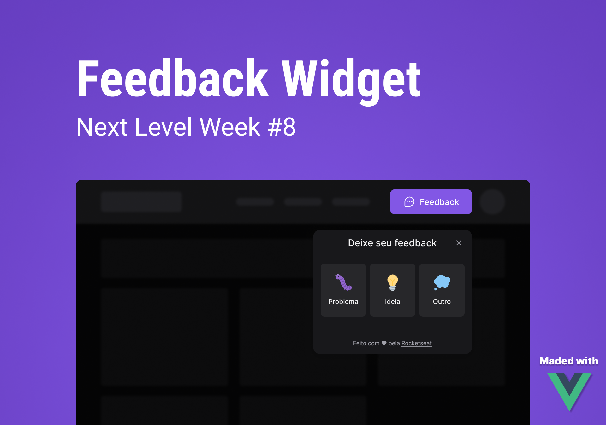

<p align="center">
    
</p>

<h1 align="center">
	NLW Return Impulse by Rockeseat - Vue.JS Version
</h1>

<p align="center">Font-end da Trilha Impulse do Evento Next Level Week Return realizado utilizando Vue.JS.</p>

## 🚀 Projeto

Um Component Widget para feedback que pode ser utilizado em qualquer site.
<br />
Projeto no ar: http://nlw-return-vuejs.vercel.app/

## 🔧 Tecnologias

- Vite
- TailWindCSS
- VueJS
- Typescript
- Axios
- Cypress
- Pinia

## 🚀 Instalando e executando o projeto

Para executar o projeto localmente na sua máquina, siga as seguintes etapas:

### Pré-requisitos

Para instalar as dependências necessárias do projeto, utilize o yarn, para instala-lo, execute o seguinte comando:

  ```sh
  npm install --global yarn
  ```

### Instalação

Siga as etapas seguintes para instalar e executar o projeto:

1. Clone o repositório

   ```sh
   git clone https://github.com/caio-2k/nlw_return_vuejs.git
   ```
2. Instale as dependências do projeto

   ```sh
   yarn install
   ```
3. Altere o nome da variável ambiente `env.local` para `.env` e informe a BASEURL da sua API

   ```js
   const VITE_API_URL = 'INSIRA A BASEURL DA SUA API';
   ```
   
4. Execute o projeto em servidor de desenvolvimento:

 ```js
   yarn dev
   ``` 

<!-- ROADMAP -->
## Roadmap

- [X] Adicionar responsividade
- [ ] Validação de campos
- [ ] Adicionar mensagens de erro
- [ ] Adicionar testes unitários (Vitest)
- [X] Adicionar testes e2e (Cypress)
- [X] Adicionar gerenciamento de estado (Pinia)

[⬆ Voltar ao topo](#-projeto)<br>
